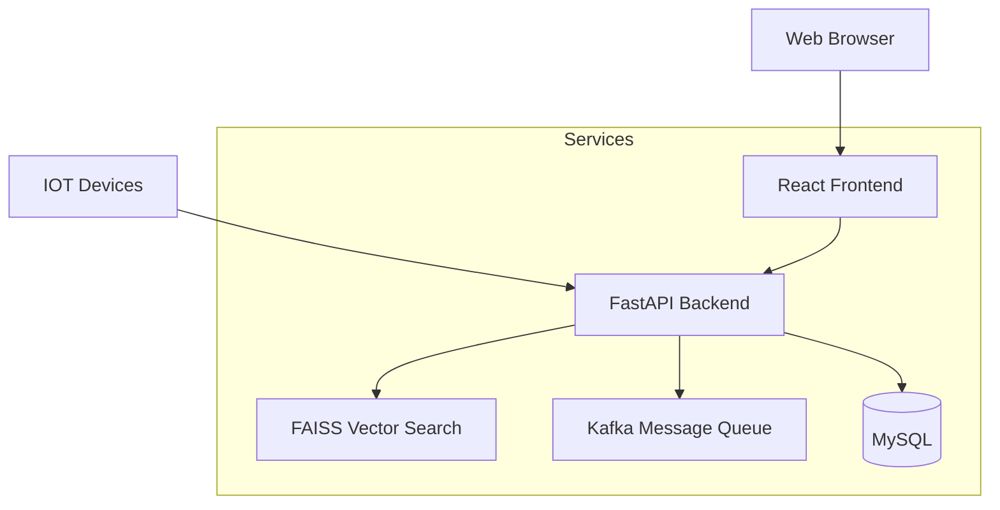

# Introduction

This is the capstone project: Facial Recognition Attendance System

[](http://34.126.168.244)
[](https://github.com/anthonyhungnguyen/capstone-project)

Made by:
- Anthony Nguyen
- Hoang Phuc
- Duc Sy

# Project Overview
The Facial Recognition Attendance System is a modern solution for tracking attendance using biometric data. It combines real-time facial recognition with a user-friendly interface to automate the attendance tracking process.

## Key Features
- Real-time facial recognition
- Automated attendance tracking
- User management system
- Report generation
- RESTful API integration
- Secure data storage

## Architecture
The system consists of several microservices:
- Frontend (React.js)
- Backend API (FastAPI)
- FAISS Vector Search Engine
- Kafka Message Queue
- MySQL Database
- IOT Attendance Devices

### System Architecture Diagram


## Prerequisites
- Docker and Docker Compose
- Git
- 4GB RAM minimum
- 10GB free disk space

# Setup Instructions

## 1. Clone the Repository
```bash
git clone https://github.com/anthonyhungnguyen/capstone-project.git
cd capstone-project
```

## 2. Environment Setup
Create a `.env` file in the root directory with the following:
```bash
MYSQL_USER=your_user
MYSQL_PASSWORD=your_password
MYSQL_DATABASE=attendance
MYSQL_ROOT_PASSWORD=your_root_password
```

# Quickstart

This script allows you to quickly load all docker components

> quickstart.sh

**Access your host to see the result**

# Development

## Running Individual Services
Each service can be started independently:
```bash
docker-compose up frontend
docker-compose up backend
docker-compose up faiss
```

## API Documentation
API documentation is available at:
- Swagger UI: `http://localhost:8000/docs`
- ReDoc: `http://localhost:8000/redoc`

# Troubleshooting
Common issues and solutions:
1. If containers fail to start, ensure all ports are available
2. For memory issues, increase Docker resources
3. Clear Docker cache if facing build issues

# Nuke

> nuke.sh

**Prune all containers**

# Technical Details

## Tech Stack
- **Frontend**: React.js, TypeScript, Material-UI
- **Backend**: FastAPI, Python 3.9+
- **Machine Learning**: FAISS, face_recognition
- **Message Queue**: Apache Kafka
- **Database**: MySQL
- **Containerization**: Docker
- **CI/CD**: GitHub Actions

## System Requirements
| Component | Minimum | Recommended |
|-----------|---------|-------------|
| CPU | 2 cores | 4 cores |
| RAM | 4GB | 8GB |
| Storage | 10GB | 20GB |
| Network | 1Mbps | 10Mbps |

## Port Requirements
| Service | Port |
|---------|------|
| Frontend | 3000 |
| Backend | 8000 |
| FAISS | 5000 |
| MySQL | 3306 |
| Kafka | 9092 |

# Deployment

## Cloud Deployment
1. Set up a VM instance (e.g., Google Cloud, AWS, Azure)
2. Install Docker and Docker Compose
3. Configure firewall rules for required ports
4. Run deployment script:
```bash
./deploy.sh production
```

## Production Considerations
- Use HTTPS for security
- Set up monitoring (Prometheus/Grafana recommended)
- Configure regular database backups
- Implement rate limiting
- Use reverse proxy (Nginx recommended)

# Contributing

## Development Setup
1. Fork the repository
2. Create a feature branch
```bash
git checkout -b feature/your-feature-name
```
3. Make your changes
4. Run tests
```bash
docker-compose run --rm backend pytest
docker-compose run --rm frontend npm test
```
5. Submit a pull request

## Coding Standards
- Follow PEP 8 for Python code
- Use ESLint for JavaScript/TypeScript
- Write unit tests for new features
- Update documentation as needed

# License
This project is licensed under the MIT License - see the [LICENSE](LICENSE) file for details.

# Support
For support, please open an issue on GitHub or contact the maintainers:
- Email: support@example.com
- Discord: [Join our server](https://discord.gg/example)
